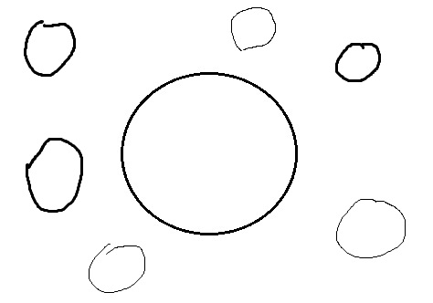
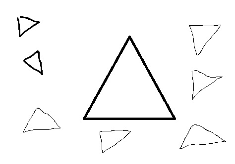
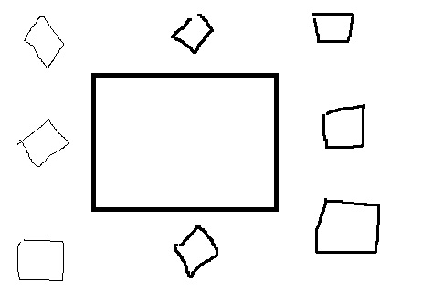
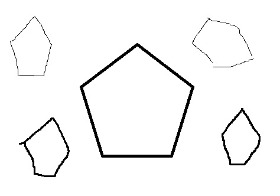
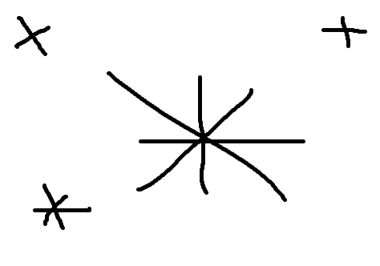
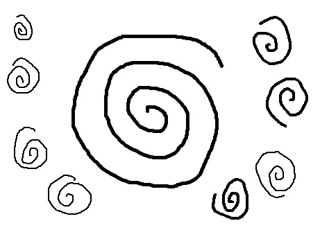

# BlueSeltzer
(refreshing code for old skool shape recognition... No AI in here!)

This little demo loads an image and tries to identify the shapes by doing some
simple edge filtering, point-cloud collection, and finally by constructing and
interpreting some basic metrics. Those metrics are:

1. Angular Spectrum (sidedness) - From the center of the bounding-box the point-cloud is
split radially into a number of pie-segments and the points in each segment are
counted and analyzed against points in adjacent segments and overall. This is actually done using an FFT
which gives a radial frequency spectrum. The goal here is to guess a geometric shape from the
radial frequencies [1,2].

2. Circularity Measure - This is calculated using the
the average point distance
from the center of a point-cloud's bounding-box, 
and the variance of that distance. Small values for this
variance would indicate a higher chance we're looking at a cloud of points that
resemble a circle.

3. Radial Density Factor - This is the slope of the radial density of the
point cloud. The first draft code does a simple line through the endpoints
of the function but a better approach would be to do a least-squares
fitting. Numbers near zero show uniformity, +ve numbers show increasing
density towards the outside edge and negative numbers show decreasing
density.

4. Radial Spectrum (dartboard) - This analysis derives a count-spectrum for each angle
around each object and then show the average frequency circularly around each object
in each angle 'wedge' and the stdev of the frequencies around the object. This analysis
is probably only useful in analyzing radially periodic patterns, like spirals. In this case
the average frequency would probably relate to the ratio between the size of the radial bins
and the size of the object under analysis, so there should be some tuning here possibly. For
patterns that are strongly radially periodic and radially symmetrical the stdev coefficient
should likely be below 1 and hopefully close to 0.

# Tests on some freehand shapes

For better or worse with the default settings!


```
circles.jpg width 474 height 332
object  x       y       sided   circ    rdens   rfavg   rfdev
1       54      52      2       0.887   -0.976  2.000   2.072
2       391     68      2       0.883   +0.000  2.000   2.121
3       228     168     6       0.927   +0.060  2.000   1.925
4       59      191     2       0.829   +0.182  2.875   1.773
```


```
tris.jpg width 474 height 332
object  x       y       sided   circ    rdens   rfavg   rfdev
1       56      53      3       0.711   +0.000  2.000   2.121
2       444     51      0       1.000   +0.000  0.062   0.066
3       382     52      4       0.646   +0.000  0.062   0.066
4       260     157     3       0.505   +0.270  3.062   1.708
5       67      127     3       0.745   +0.000  2.000   2.121
6       444     155     15      0.811   +0.000  0.375   0.398
7       389     198     4       0.728   +0.000  0.188   0.199
8       76      219     0       1.000   +0.000  0.062   0.066
9       387     255     4       1.000   +0.000  0.125   0.133
11      119     258     4       0.646   +0.000  0.062   0.066
12      48      266     0       1.000   +0.000  0.062   0.066
13      261     266     0       1.000   +0.000  0.062   0.066
14      202     267     0       1.000   +0.000  0.062   0.066
15      452     285     2       0.597   +0.000  0.250   0.265
16      364     299     0       1.000   +0.000  0.062   0.066
17      207     307     0       1.000   +0.000  0.062   0.066
```


```
squares.jpg width 474 height 332
object  x       y       sided   circ    rdens   rfavg   rfdev
1       364     30      4       0.850   +0.000  2.000   2.121
2       210     36      4       0.840   +0.000  1.938   2.055
4       51      73      0       1.000   +0.000  0.062   0.066
5       202     155     4       0.744   +0.644  3.000   1.825
6       376     138     4       0.864   -0.992  2.000   2.110
7       380     247     4       0.827   +0.278  2.812   1.711
8       214     275     4       0.845   +0.000  2.000   2.121
9       67      306     0       1.000   +0.000  0.062   0.066
```


```
hexagons.jpg width 474 height 332
object  x       y       sided   circ    rdens   rfavg   rfdev
1       353     31      5       0.557   +0.000  0.250   0.265
2       231     169     5       0.814   +0.274  2.188   1.875
3       73      127     0       1.000   +0.000  0.062   0.066
4       407     231     2       0.752   +0.247  2.562   1.721
5       74      249     4       0.740   +0.520  3.125   1.754
```


```
stars.jpg width 474 height 332
object  x       y       sided   circ    rdens   rfavg   rfdev
1       429     39      4       0.675   +0.000  1.562   1.657
2       43      45      4       0.666   +0.000  1.750   1.856
4       256     170     14      0.452   -0.258  1.938   1.469
8       77      257     5       0.690   -0.840  1.750   1.722
```


```
spirals.jpg width 474 height 332
object  x       y       sided   circ    rdens   rfavg   rfdev
1       35      39      2       0.662   +0.000  1.812   1.922
2       391     58      2       0.700   -0.624  2.000   1.791
4       212     160     2       0.605   -0.083  2.000   0.445
5       40      108     2       0.601   +0.000  1.750   1.856
7       413     147     2       0.731   -0.694  2.000   1.839
10      37      188     2       0.595   +0.000  1.250   1.326
11      46      222     2       0.688   +0.000  2.000   2.121
12      365     267     2       0.596   -0.244  1.375   0.771
13      100     280     2       0.627   -0.935  2.000   2.004
```

## Dubious References

1. "Radial frequency patterns describe a small and perceptually distinct subset of all possible planar shapes" https://www.sciencedirect.com/science/article/pii/S0042698918302219
2. "The role of local features in shape discrimination of contour- and surface-defined radial frequency patterns at low contrast" https://www.sciencedirect.com/science/article/pii/S0042698911003555
3. "Boundaries and Coastlines: The Fractals Paradox" https://www.georgeszpiro.com/22-fractal-coastline
