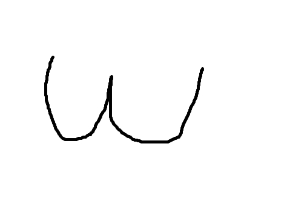
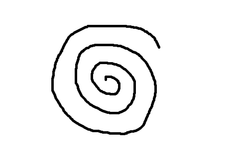

# BlueSeltzer
(refreshing code for old skool shape recognition... No AI in here!)

This little demo loads an image and tries to identify the shapes by doing some
simple edge filtering, point-cloud collection, and finally by constructing and
interpreting some basic metrics. Those metrics are:

1. Angular Power Sprectum (sidedness) - From the center of the bounding-box the point-cloud is
split radially into a number of pie-segments and the points in each segment are
counted and analyzed against points in adjacent segments and overall. This is actually done using an FFT
which gives a radial frequency spectrum. The goal here is to guess a geometric shape from the
radial frequencies [1,2].

2. Circularity Measure - This is calculated using the
the average point distance
from the center of a point-cloud's bounding-box, 
and the variance of that distance. Small values for this
variance would indicate a higher chance we're looking at a cloud of points that
resemble a circle.

3. Radial Density Factor - This is the slope of the radial density of the
point cloud. The first draft code does a simple line through the endpoints
of the function but a better approach would be to do a least-squares
fitting. Numbers near zero show uniformity, +ve numbers show increasing
density towards the outside edge and negative numbers show decreasing
density.

And now for some tests!

## A Circle?


```
circle.jpg width 474 height 332
object  x       y       sided   circ    rdens
1       228     168     6       0.9267  1.0000

```

## A Triangle?


```
tri.jpg width 474 height 332
object  x       y       sided   circ    rdens
1       260     157     3       0.5046  0.0290

```

## Shapes Everywhere!

It looks like object 2 isn't recognized. I'm not sure what is happening there...


```
circ-tri-squ-pent.jpg width 474 height 332
object  x       y       sided   circ    rdens
1       98      86      5       0.8307  0.0674
3       269     89      4       0.7926  0.1294
4       411     56      2       0.9009  -0.9774
5       416     119     6       0.9279  0.0000
6       358     234     3       0.5628  0.0249
7       242     197     3       0.7683  -0.3309
8       130     252     5       0.8619  0.0238
```

## Tricky shapes...

These are a work in progress. The first stage has been in ensuring the point-clouds
are unified. Later stages to the analysis might be a radial-density,
linear-segment-length or fractal shape analysis to disambiguate stars from spirals.


```
uu.jpg width 474 height 332
object  x       y       sided   circ    rdens
1       204     164     2       0.2879  0.0028
```


```
stars.jpg width 474 height 332
object  x       y       sided   circ    rdens
1       429     39      4       0.6746  -0.6409
2       43      45      4       0.6660  -0.6027
4       256     170     14      0.4523  -0.1504
8       77      257     5       0.6897  -0.0998
```


```
spiral.jpg width 474 height 332
object  x       y       sided   circ    rdens
1       212     160     2       0.6050  0.0368
```

## Dubious References

1. "Radial frequency patterns describe a small and perceptually distinct subset of all possible planar shapes" https://www.sciencedirect.com/science/article/pii/S0042698918302219
2. "The role of local features in shape discrimination of contour- and surface-defined radial frequency patterns at low contrast" https://www.sciencedirect.com/science/article/pii/S0042698911003555
3. "Boundaries and Coastlines: The Fractals Paradox" https://www.georgeszpiro.com/22-fractal-coastline