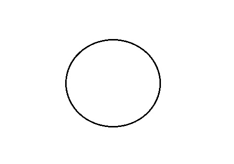
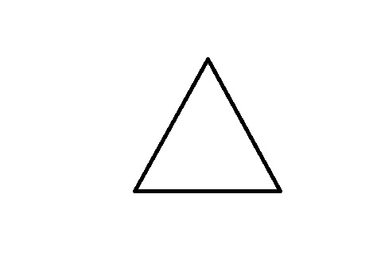
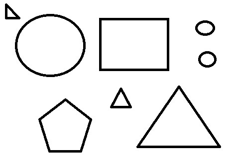

# BlueSeltzer
(refreshing code for old skool shape recognition... No AI in here!)

This little demo loads an image and tries to identify the shapes by doing some
simple edge filtering, point-cloud collection, and finally by constructing and
interpreting some basic metrics. Those metrics are:

1. Circularity Measure - This is calculated using the
the average point distance
from the center of a point-cloud's bounding-box, 
and the variance of that distance. Small values for this
variance would indicate a higher chance we're looking at a cloud of points that
resemble a circle.

2. Angular Power Sprectum - From the center of the bounding-box the point-cloud is
split radially into a number of pie-segments and the points in each segment are
counted and analyzed against points in adjacent segments. This is actually done using an FFT
which actually gives a real frequency spectrum for the periodicity of the point
counts in each segment. The goal here is to guess a geometric shape from the 
radial point distribution frequency [1,2].

And now for some tests!

## A Circle?

 ```
 c:\blueseltzer.exe circle.jpg
  ```

```
image width 474 height 332
object 1 at  228  168 has  6 sided symmetry and is very likely circular
```

## A Triangle?

```
c:\blueseltzer.exe tri.jpg
```

```
image width 474 height 332
object 1 at  260  157 has  3 sided symmetry and is likely not circular
```

## Shapes Everywhere!

```
c:\blueseltzer.exe circ-tri-squ-pent.jpg
```


```
image width 474 height 332
object 1 at   73   86 has  2 sided symmetry and is likely not circular
object 2 at  118   89 has  2 sided symmetry and is possibly circular
object 3 at  269   89 has  4 sided symmetry and is likely not circular
object 4 at  411   56 has  2 sided symmetry and is very likely circular
object 5 at  416  119 has  6 sided symmetry and is very likely circular
object 6 at  358  234 has  3 sided symmetry and is likely not circular
object 7 at  242  197 has  3 sided symmetry and is likely not circular
object 8 at  130  252 has  5 sided symmetry and is possibly circular
```

## Dubious References

1. "Radial frequency patterns describe a small and perceptually distinct subset of all possible planar shapes" https://www.sciencedirect.com/science/article/pii/S0042698918302219
2. "The role of local features in shape discrimination of contour- and surface-defined radial frequency patterns at low contrast" https://www.sciencedirect.com/science/article/pii/S0042698911003555
